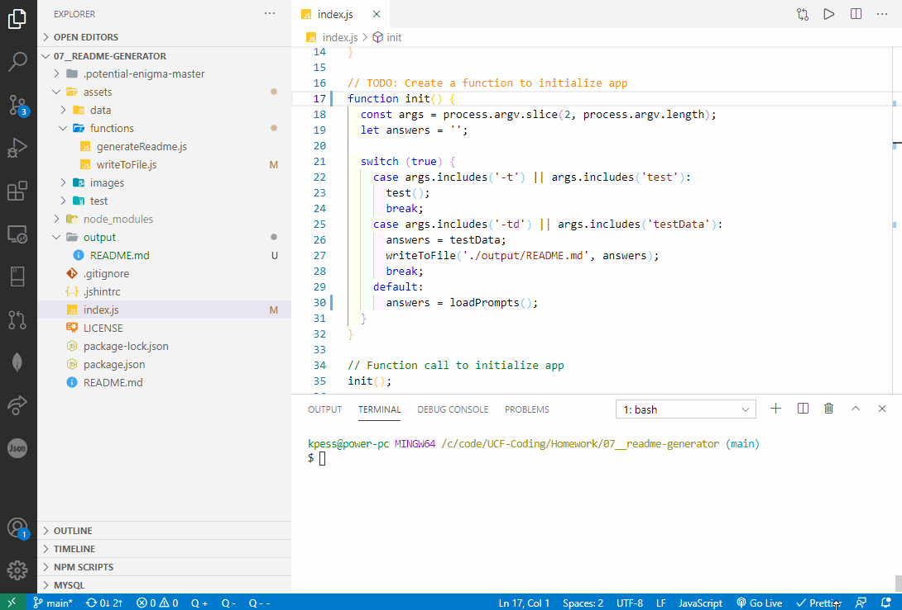

  # readme-generator
  
  
## Description
A node.js application to generate readme's for github projects.

## Table of Contents
* [Installation](#installation)
* [Usage](#usage)
* [License](#license)
* [Contributing](#contributing)
* [Tests](#tests)
* [Questions](#questions)

## Installation
clone and download repository files.  Use <code>npm install</code> to install project dependencies.  Run with <code>node index.js</code>

## Usage
Run in terminal with <code>node index.js</code> and fill out prompts to generate readme

## License

  
A short and simple permissive license with conditions only requiring preservation of copyright and license notices. Licensed works, modifications, and larger works may be distributed under different terms and without source code.

## Contributing
Feel free to contribute.

## Tests
You can run test data with extra argument in command line '-td' <code>node index.js -td</code>

## Questions
Visit my [Github](http://www.github.com/kpessa) at github.com/kpessa

or
email me at [kpessa@gmail.com](mailto:kpessa@gmail.com)
  
